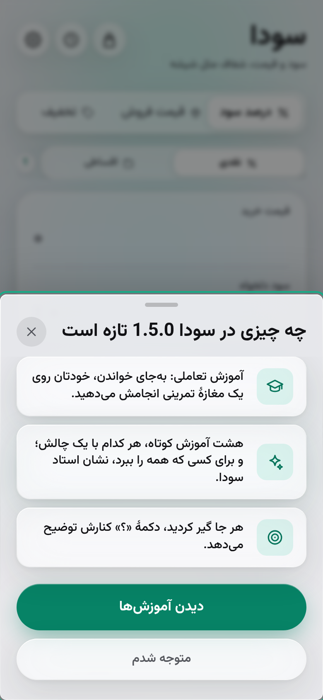

<div align="center">

[🇬🇧 **English version**](./README.md)

<br />


# سودا

### سود و قیمت، شفاف مثل شیشه 💎

**ماشین‌حساب شیشه‌ای برای فروشنده‌ها و خریدارهای باهوش** — سود، قیمت و تخفیف را با یک لمس بدانید.
صددرصد آفلاین کار می‌کند. فارسی و انگلیسی حرف می‌زند. هیچ‌چیز را ردیابی نمی‌کند.

<br />

<a href="https://mahdi-mortazavi.github.io/sooda/"></a>

[](https://github.com/Mahdi-mortazavi/sooda/actions/workflows/deploy.yml)
[](https://mahdi-mortazavi.github.io/sooda/)
[](https://mahdi-mortazavi.github.io/sooda/)
[](./LICENSE)

<br />


</div>

<br />

<div dir="rtl">

## 🧮 چه کاری برایتان می‌کند؟

هر کدام را که بلدید بدهید، بقیه را سودا حساب می‌کند:

| شما دارید… | سودا می‌گوید… |
| --- | --- |
| 🏷 قیمت خرید + **درصد سود** دلخواه | **قیمت فروش** و مبلغ سود |
| ⚖️ قیمت خرید + **قیمت فروش** | **درصد سود** واقعی (اگر ضرر باشد، صادقانه و قرمز!) |
| 🛍 قیمت اصلی + **درصد تخفیف** | **قیمت نهایی** و مبلغ صرفه‌جویی |
| 🔄 قیمت نهایی + **درصد تخفیف** | **قیمت اصلیِ** قبل از تخفیف |
| 🧺 چند معامله با هم | **جمع سبد** — جمع خرید، فروش، سود و حاشیه سود کل |
| ⏳ **پول‌تان کی برمی‌گردد** | **سود واقعی** — آنچه بعد از خرید دوبارهٔ همان جنس برایتان می‌ماند |
| 💳 قیمت نقدی + **تعداد اقساط** | **قسط ماهانه**، جمع دریافتی و درصد اضافه‌ای که واقعاً لازم است |
| 📅 شرایط اقساطی که همین حالا می‌دهید | اینکه **از فروش نقدی بهتر است یا نه** — به درصد و به مبلغ |
| 📦 کالاهایی که می‌فروشید | **کالاهای من** — کدام‌ها بی‌سروصدا زیان‌ده شده‌اند |

## ✨ چرا عاشقش می‌شوید؟

- **📈 سود واقعی، نه سود ظاهری** — «قیمت خرید + ۲۰٪» ممکن است باز هم برای خرید دوبارهٔ همان جنس کافی نباشد. به سودا بگویید پول‌تان کی برمی‌گردد تا قیمتی را نشان‌تان دهد که هزینهٔ خرید دوباره را هم می‌پوشاند.
- **💳 اقساط، به زبان بازار** — قسط ماهانه، جمع دریافتی و **معادل سود سادهٔ ماهانه**؛ به‌علاوه پاسخ روشن به «شرایط فعلی‌ام سودده است؟» و جدول اقساطی با تاریخ شمسی که می‌توانید مستقیم برای مشتری بفرستید.
- **📦 کالاهای من** — کالاهای‌تان را ذخیره کنید؛ سودا قیمت خرید هر کدام را با تورم به‌روز می‌کند و آن‌هایی را که زیان‌ده شده‌اند نشان می‌دهد. قیمت‌ها را گروهی تغییر دهید، پیش‌نمایش ببینید و تا ده ثانیه برگردانید.
- **📴 واقعاً آفلاین** — بعد از اولین بازدید، برای همیشه حتی در حالت هواپیما کار می‌کند. نه لودینگ، نه «اتصال را بررسی کنید».
- **🔒 حریم خصوصی مطلق** — بدون سرور، بدون حساب کاربری، بدون ردیابی. اعداد شما هرگز از گوشی‌تان خارج نمی‌شود؛ تنها چیزی که سودا دریافت می‌کند، فایل عمومی نرخ‌ها از سایت خودش است.
- **⚡ فوری** — اولین نمایش در حدود ۰٫۸ ثانیه روی اینترنت ضعیف؛ امتیاز کامل **۱۰۰/۱۰۰/۱۰۰/۱۰۰** در Lighthouse.
- **🌐 فارسیِ واقعی** — راست‌چین کامل، ارقام فارسی همه‌جا (بنویسید ۲۵۰۰۰۰، ببینید ۲۵۰٬۰۰۰)، تاریخ شمسی در تاریخچه، تغییر آنی زبان.
- **💱 واحد پول خودتان** — تومان، ریال، دلار یا یورو روی همهٔ نتیجه‌ها، تاریخچه و خروجی CSV.
- **🔢 جداکنندهٔ سه‌رقمی زنده** — همان لحظه که تایپ می‌کنید اعداد مرتب می‌شوند: ۱۲۵۰۰۰۰ می‌شود ۱٬۲۵۰٬۰۰۰.
- **🔗 نتیجهٔ قابل اشتراک** — هر محاسبه را با یک لینک بفرستید؛ گیرنده همان نتیجه را آماده می‌بیند، حتی آفلاین.
- **🧺 سبد محاسبه** — چند محاسبه را اضافه کنید و جمع کل و حاشیه سود کل را یک‌جا ببینید.
- **🔢 رند کردن قیمت** — قیمت فروش را به هزار، پنج‌هزار، ده‌هزار یا پنجاه‌هزار **رو به بالا** رند کنید تا حاشیهٔ سودتان کم نشود؛ عدد دقیق هم زیرش می‌ماند.
- **💾 پشتیبان‌گیری و بازیابی** — یک فایل JSON از کالاها، تاریخچه، سبد و تنظیمات؛ هنگام بازگشت بین ادغام و جایگزینی انتخاب کنید.
- **🔄 همیشه به‌روز** — اپ هر ساعت و هر بار که به آن برمی‌گردید نسخهٔ جدید را بررسی می‌کند، آنچه در حال نوشتنش بودید را نگه می‌دارد و یک‌بار تازه‌ها را نشان‌تان می‌دهد.
- **💎 طراحی شیشهٔ مایع** — بلور واقعی پس‌زمینه، جلوهٔ شکست نور، رنگ‌های محیطی و فیزیک فنری. حس یک اپ بومی iOS، نه یک وب‌سایت.
- **📲 نصب با یک لمس** — پیشنهاد نصب بومی در اندروید، راهنمای تصویری برای آیفون، و میان‌برهای صفحهٔ اصلی برای هر ماشین‌حساب.
- **♿ دسترس‌پذیر** — سازگار با صفحه‌خوان، صفحه‌کلید کامل و احترام به `prefers-reduced-motion`.

## 📈 نرخ گرانی هوشمند

سودا هیچ‌وقت از شما «نرخ تورم» را نمی‌پرسد — کسی آن را دقیق نمی‌داند و اصلاً یک عدد نیست.
موبایل با دلار بالا می‌رود، پوشاک با هزینه‌های داخلی، و مواد غذایی مسیر خودش را دارد. برای همین
سودا برای **هر کالا یک نرخ گرانی ماهانه** تخمین می‌زند و نشان می‌دهد این عدد از کجا آمده است.

سه سیگنال که برای هر کالا با هم ترکیب می‌شوند:

۱. **تاریخچهٔ قیمت خودتان.** هر قیمت خریدی که ثبت می‌کنید یک نقطهٔ داده است. سودا خطی از میان
   آن‌ها می‌گذراند و به قیمت‌های تازه‌تر وزن بیشتری می‌دهد. این قوی‌ترین و خصوصی‌ترین سیگنال است و
   هرگز از گوشی شما خارج نمی‌شود.
۲. **تورم دسته‌بندی.** دستهٔ هر کالا به گروه متناظرش در شاخص رسمی قیمت وصل می‌شود، تا قیمت یک
   بوتیک با شاخص مواد غذایی سنجیده نشود.
۳. **وابستگی به دلار.** هر کالا را ایرانی، نیمه‌وارداتی یا وارداتی علامت بزنید تا سودا نرخ دلار
   بازار آزاد را به همان اندازه در حساب بیاورد.

هرچه قیمت بیشتری ثبت کنید، تخمین بیشتر به **مغازهٔ خودتان** تکیه می‌کند تا به میانگین کشوری — و
کارت نرخ دقیقاً می‌گوید چند درصد عدد از کجا آمده. همهٔ اعداد با «حدود» نشان داده می‌شوند و هر وقت
بخواهید می‌توانید نرخ را دستی تعیین کنید.

**حریم خصوصی تغییری نکرده است.** سودا فقط یک فایل عمومی نرخ‌ها را از سایت خودش می‌گیرد. هیچ چیزی
دربارهٔ کالاها، قیمت‌ها یا کسب‌وکار شما ارسال نمی‌شود — اصلاً سروری وجود ندارد که ارسال شود.
به‌روزرسانی خودکار نرخ‌ها را می‌توانید در تنظیمات خاموش کنید؛ آن وقت سودا از نسخهٔ همراه خودش
استفاده می‌کند.

## 📱 اسکرین‌شات‌ها

</div>

<div align="center">

| درصد سود | فروش با ضرر | تخفیف |
| :---: | :---: | :---: |
|  |  |  |

| تخفیف معکوس | سبد محاسبه | تاریخچه |
| :---: | :---: | :---: |
|  |  |  |

| اولین ورود | راهنمای نصب آیفون | تنظیمات |
| :---: | :---: | :---: |
|  |  |  |

**تازه‌های نسخهٔ ۱٫۳**

| سود واقعی | فروش اقساطی | جدول اقساط |
| :---: | :---: | :---: |
|  |  |  |

| کالاهای من | تازه‌ها | نمای انگلیسی |
| :---: | :---: | :---: |
|  |  |  |

</div>

<div dir="rtl">

## 📲 مثل یک اپ نصبش کنید

۱. آدرس **[mahdi-mortazavi.github.io/sooda](https://mahdi-mortazavi.github.io/sooda/)** را باز کنید

۲. **آیفون و آی‌پد (سافاری):** دکمهٔ Share ← گزینهٔ *Add to Home Screen* — خود اپ راهنمای تصویری قدم‌به‌قدم دارد

۳. **اندروید (کروم):** روی بنر **«نصب»** که سودا نشان می‌دهد بزنید، یا منوی ⋮ ← *Add to Home screen*

۴. **دسکتاپ (کروم/اج):** آیکون نصب در نوار آدرس

بعد از نصب، انگشت‌تان را روی آیکون نگه دارید تا **میان‌برهای** درصد سود، قیمت فروش، تخفیف و کالاهای من را ببینید. ✈️ حالا حالت هواپیما را روشن کنید — همه‌چیز همچنان کار می‌کند!

## 🛠 پشت صحنه

| لایه | انتخاب |
| --- | --- |
| ساخت | Vite + TypeScript (strict) |
| رابط کاربری | React 18 · Tailwind CSS v4 · فیزیک فنری motion |
| PWA | vite-plugin-pwa — پیش‌ذخیرهٔ کامل Workbox، به‌روزرسانی خودکار، میان‌بر |
| ذخیره‌سازی | Dexie (IndexedDB) — تاریخچه، سبد و کالاها |
| چندزبانگی | i18next + react-i18next با اولویت راست‌چین |
| فونت‌ها | وزیرمتن و Inter متغیر، خود-میزبان — بدون هیچ CDN |
| ماشین‌حساب‌ها | یک رجیستری از حالت‌ها؛ هر حالت یک `compute` و `present` خالص با فیلدهای خودش |
| سرعت | پوستهٔ استاتیک pre-paint، CSS بحرانی درون HTML، یک بستهٔ ترجمه برای هر زبان، تقسیم کد، SW تأخیری |
| تست | Vitest — ۲۷۷ تست واحد، به‌علاوهٔ `npm run smoke` که جریان‌های واقعی را در مرورگر اجرا می‌کند |
| CI/CD | GitHub Actions ← GitHub Pages |

## 🧑‍💻 توسعهٔ محلی

</div>

```bash
git clone https://github.com/Mahdi-mortazavi/sooda.git
cd sooda
npm install
npm run dev        # اجرای سرور توسعه
npm test           # اجرای تست‌ها
npm run verify     # بررسی تایپ + تست + بیلد نهایی
npm run smoke      # اجرای جریان‌های واقعی در مرورگر
npm run budget     # اگر حجم بارگذاری اولیه زیاد شده باشد، خطا می‌دهد
npm run i18n:check # اگر ترجمهٔ فارسی و انگلیسی از هم فاصله بگیرند، خطا می‌دهد
```

<div dir="rtl">

## 🗺 نقشهٔ راه

- [x] چهار ماشین‌حساب: درصد سود، قیمت فروش، تخفیف و تخفیف معکوس
- [x] دوزبانهٔ کامل با راست‌چین · ارقام فارسی · جداکنندهٔ سه‌رقمی زنده
- [x] PWA آفلاین · تجربهٔ نصب · میان‌برهای صفحهٔ اصلی
- [x] تاریخچه + CSV · واحد پول · لینک اشتراک · سبد محاسبه
- [x] سود واقعی — سود ظاهری در برابر آنچه بعد از خرید دوباره می‌ماند
- [x] فروش اقساطی، بررسی شرایط فعلی و جدول اقساط برای مشتری
- [x] کالاهای من با نشان سلامت قیمت، تغییر گروهی و برگرداندن
- [x] گرد کردن قابل‌تنظیم (رند کردن قیمت فروش رو به بالا)
- [x] پشتیبان‌گیری و بازیابی · بررسی خودکار به‌روزرسانی · نمایش تازه‌ها
- [ ] نام‌گذاری اقلام سبد و خروجی گرفتن از سبد
- [ ] تاریخچهٔ قیمت هر کالا و نمودار روند حاشیهٔ سود
- [ ] یادداشت تأمین‌کننده و یادآور سفارش مجدد

## 👋 با سازنده آشنا شوید

</div>

<div align="center">


**مهدی مرتضوی** · Mahdi Mortazavi

سازندهٔ سودا — خوشحال می‌شوم نظرات، پیشنهادات و سلام‌هایتان را بشنوم.

<a href="https://telegram.me/Mahdi_mortazavi1"></a>

*برکت در کار و کاسبی‌تان جاری باد 🌿✨*

</div>

<div dir="rtl">

## 🤝 مشارکت و مجوز

از مشارکت شما استقبال می‌کنیم — [CONTRIBUTING.md](./CONTRIBUTING.md) و [آیین‌نامهٔ رفتار](./CODE_OF_CONDUCT.md) را ببینید. منتشرشده با مجوز [MIT](./LICENSE).

</div>
