<div align="center">

[🇬🇧 **English version**](./README.md)

<br />

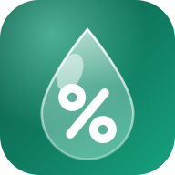

# سودا

### سود و قیمت، شفاف مثل شیشه 💎

**۲۰٪ سود گرفتید، ولی با همان پول می‌توانید دوباره جنس بخرید؟ سودا جواب همین سؤال است.**

ماشین‌حساب سود، قیمت و تخفیف برای فروشنده‌ها. کامل آفلاین کار می‌کند،
فارسی و انگلیسی حرف می‌زند، و هیچ‌چیز را ردیابی نمی‌کند.

<br />

<a href="https://mahdi-mortazavi.github.io/sooda/"></a>&nbsp;<a href="#-ببین-چطور-کار-می‌کند"></a>

[](https://github.com/Mahdi-mortazavi/sooda/actions/workflows/deploy.yml)
[](https://mahdi-mortazavi.github.io/sooda/)
[](./LICENSE)

<br />

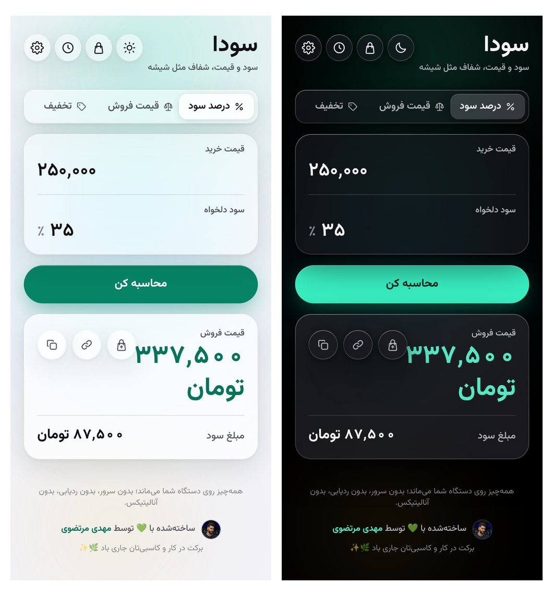

</div>

<br />

<div dir="rtl">

## 🎬 ببین چطور کار می‌کند

شصت ثانیه، بدون روایت: آن ۲۰٪ سودی که وقت خرید دوباره می‌بینی ۱۰٫۳۲٪ بوده، قیمت
پیشنهادی‌ای که قفسه را همان‌طور که بود برمی‌گرداند، و نشان سلامتی که می‌گوید یک
کالا هنوز می‌ارزد یا نه.

</div>

<div align="center">

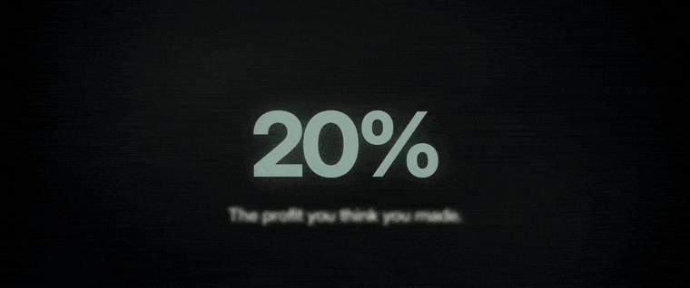

</div>

https://github.com/user-attachments/assets/3dbf0248-3ff3-4caf-a576-fc36ea4ead07

<div align="center">

<sub>لوپ بالا بی‌صداست — <b>پلی را بزن تا کل شصت ثانیه با صدا پخش شود.</b> رابطی که در آن می‌بینی کشیده شده، نه فیلم‌برداری‌شده؛ خودِ برنامه یک کلیک فاصله دارد: <a href="https://mahdi-mortazavi.github.io/sooda/">mahdi-mortazavi.github.io/sooda</a> — بدون حساب کاربری و بدون نصب باز می‌شود. فایلش در مخزن هست: <a href="docs/marketing/sooda-film.mp4"><code>docs/marketing/sooda-film.mp4</code></a>.</sub>

</div>

<br>

<div dir="rtl">

## 📖 داستان آقا رضا

ساعت ۹ شب است و آقا رضا کرکرهٔ مغازه را پایین می‌کشد. امروز ده شال فروخته، هر کدام با
۲۰٪ سود، و راضی است. شال‌ها را سه ماه پیش، هر کدام ۴۰۰٬۰۰۰ تومان خریده بود.

فردا صبح بنکدار زنگ می‌زند: «قیمت‌ها رفته بالا.» تازه آن‌جا متوجه می‌شود با پول آن ده شال،
دیگر نمی‌تواند ده شال بخرد. سود کاغذی‌اش ۸۰٬۰۰۰ تومان بود؛ ولی خرید دوبارهٔ همان شال حالا
حدود ۴۴۲٬۲۰۳ تومان آب می‌خورد. یعنی از آن ۲۰٪، در عمل حدود ۸٫۵۵٪ برایش مانده.

سودا برای همین لحظه ساخته شده. آقا رضا قیمت خرید و قیمت فروش را می‌زند و سودا کنار
«سود ظاهری»، **«سود واقعی»** را هم نشان می‌دهد — با برچسب «کم‌سود»، و یک قیمت پیشنهادی
که پول خرید دوباره را هم برمی‌گرداند.

بعدازظهر مشتری‌ای می‌آید که می‌خواهد یک کالای ۱۰ میلیونی را قسطی بردارد. آقا رضا
«شرایط فعلی‌ام سودده است؟» را باز می‌کند و می‌بیند ماهی ۲٪ ساده که همیشه می‌گرفته، امروز
تقریباً **سر به سر** است (حدود ۰٫۱۲٪ زیان) — یعنی عملاً مجانی کار می‌کند. عدد را اصلاح
می‌کند و جدول اقساط را بدون هیچ حرفی از سود خودش برای مشتری می‌فرستد.

و آن کالای وارداتی که قیمتش به دلار بند است؟ سودا برای هر کالا جداگانه تخمین می‌زند که
ماهی چند درصد گران می‌شود — و می‌گوید این عدد از کجا آمده.

## ⚡ سودا در ۳۰ ثانیه

<div align="center">
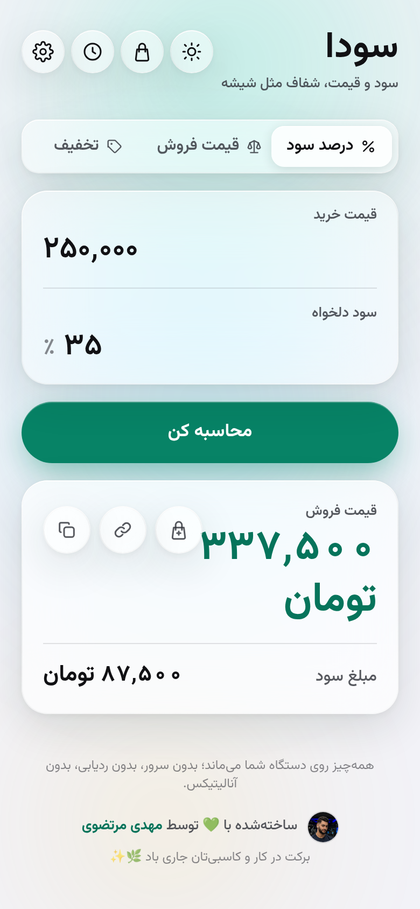
</div>

۱. [سودا را باز کنید](https://mahdi-mortazavi.github.io/sooda/) — نصب و ثبت‌نام ندارد.
۲. در «درصد سود»، **قیمت خرید** را ۴۰۰٬۰۰۰ و **سود دلخواه** را ۲۰ بزنید.
۳. **«محاسبه کن»** را لمس کنید.

قیمت فروش: **۴۸۰٬۰۰۰** · مبلغ سود: **۸۰٬۰۰۰**

همین. بقیهٔ این راهنما دربارهٔ کارهایی است که سودا *علاوه بر این* برایتان می‌کند.

---

## 🎓 آموزش تعاملی

**کی به کارتان می‌آید؟** بار اولی که سودا را باز می‌کنید، و هر وقت بعد از آن که خواستید بخشی
از برنامه را یاد بگیرید. چیزی برای خواندن نیست — روی همان دکمه‌های واقعی کار می‌کنید.

**چه کار کنید**
۱. بار اول، سودا خودش یک تمرین کوتاه پیشنهاد می‌دهد؛ «**با هم حسابش کنیم**» را بزنید.
۲. بعداً، از **تنظیمات** کارت «**آموزش سودا**» را باز کنید.
۳. هر درس را که خواستید بزنید — و هر وقت خواستید «**رد شدن**».

**مثال** — تمرین اول: آقا رضا شالی را ۱۰۰٬۰۰۰ تومان خریده و ۲۰٪ سود می‌خواهد. چهار لمس بعد
می‌بینید که اگر همان شال سه ماه روی دستش بماند، آن ۲۰٪ روی کاغذ، در واقع **کمتر از ۱۰٪** است.
کل تمرین حدود یک دقیقه طول می‌کشد.

**نکته** — همهٔ این کارها در یک **مغازهٔ تمرینی** انجام می‌شود: پنج کالای نمونه که فقط برای
آموزش ساخته می‌شوند و وقتی درس تمام شد پاک می‌شوند. کالاها، قیمت‌ها و تاریخچهٔ خودتان
دست نمی‌خورد. اگر جایی گیر کردید، «**نشانم بده**» همان کار را جلوی چشم‌تان انجام می‌دهد.

هشت درس هست — درصد سود، تخفیف، سود واقعی، اقساط، کالاها، نرخ گرانی، کار روزمره، و پشتیبان‌گیری —
و هرکدام بین ۵۰ تا ۹۰ ثانیه است. آخر هر درس یک سؤال کوچک پرسیده می‌شود؛ جوابش را خود موتور
محاسبهٔ سودا بررسی می‌کند، و اگر اشتباه بود هیچ‌کس سرزنش‌تان نمی‌کند — دوباره امتحان می‌کنید.

---

## 📘 راهنمای قدم‌به‌قدم

### 🧮 درصد سود

**کی به کارتان می‌آید؟** وقتی قیمت خرید را می‌دانید و می‌خواهید با سود مشخصی بفروشید.

**چه کار کنید**
۱. برگهٔ **«درصد سود»** را باز کنید.
۲. **«قیمت خرید»** و **«سود دلخواه»** را بنویسید.
۳. **«محاسبه کن»**.

**مثال** — شال ۴۰۰٬۰۰۰ تومانی با ۲۰٪ سود: قیمت فروش **۴۸۰٬۰۰۰**، مبلغ سود **۸۰٬۰۰۰**.

<div align="center">

</div>

**نکته** — این «سود ظاهری» است. برای اینکه ببینید بعد از خرید دوباره چقدر برایتان می‌ماند،
سراغ «سود واقعی» بروید.

---

### 🏷 قیمت فروش

**کی به کارتان می‌آید؟** وقتی قیمتی روی جنس گذاشته‌اید و می‌خواهید بدانید چند درصد سود است.

**چه کار کنید**
۱. برگهٔ **«قیمت فروش»**.
۲. **«قیمت خرید»** و **«قیمت فروش»** را بزنید.
۳. **«محاسبه کن»**.

**مثال** — خرید ۴۰۰٬۰۰۰، فروش ۴۸۰٬۰۰۰: **۲۰٪** سود، یعنی **۸۰٬۰۰۰** تومان.

**نکته** — اگر ضرر باشد، سودا با رنگ و با جملهٔ «با این قیمت ضرر می‌کنید.» هشدار می‌دهد؛
فقط به رنگ تکیه نمی‌کند.

---

### 🎁 تخفیف و تخفیف معکوس

**کی به کارتان می‌آید؟** برای حراج، و برای وقتی می‌خواهید بفهمید قیمت اصلی چه بوده.

**چه کار کنید**
۱. برگهٔ **«تخفیف»** (یا **«تخفیف معکوس»**).
۲. قیمت و درصد را بزنید.
۳. **«محاسبه کن»**.

**مثال** — ۱۵٪ روی ۴۸۰٬۰۰۰: قیمت نهایی **۴۰۸٬۰۰۰**، صرفه‌جویی **۷۲٬۰۰۰**.
و برعکس: قیمت ۴۰۸٬۰۰۰ که ۱۵٪ تخفیف خورده، اصلش **۴۸۰٬۰۰۰** بوده.

<div align="center">
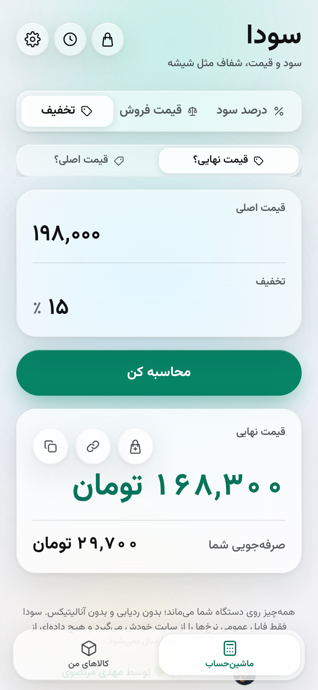
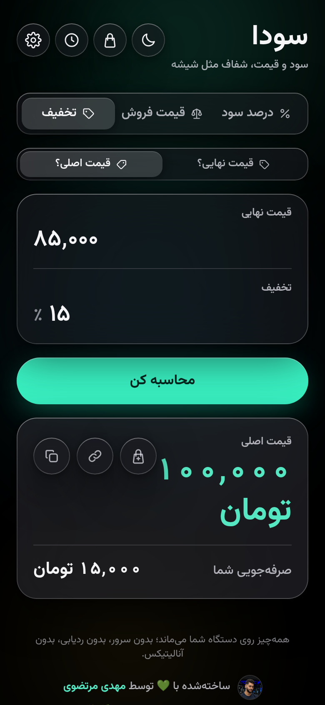
</div>

**نکته** — «تخفیف معکوس» برای چک‌کردن تخفیف‌های تبلیغاتی عالی است.

---

### 💸 سود واقعی — «پول‌تان کی برمی‌گردد؟»

**کی به کارتان می‌آید؟** همیشه. این مهم‌ترین بخش سوداست.

**چه کار کنید**
۱. در «درصد سود» یا «قیمت فروش»، بخش **«پول‌تان کی برمی‌گردد؟»** را باز کنید.
۲. بزنید پول‌تان چند ماه بعد برمی‌گردد: **«الان»**، **«۱ ماه»**، **«۳ ماه»**، **«۶ ماه»** یا **«۱۲ ماه»**.
۳. اگر قیمت خرید جدید را می‌دانید، **«قیمت خرید فعلی را می‌دانم»** را بزنید؛ وگرنه
   **«با تورم تخمین بزن»** را بگذارید بماند.

**مثال** — شال ۴۰۰٬۰۰۰ که ۴۸۰٬۰۰۰ فروخته شده و پولش ۳ ماه بعد برمی‌گردد:

| | |
| --- | --- |
| سود ظاهری | ۲۰٪ |
| گرانی ماهانه | ۳٫۴٪ |
| هزینهٔ خرید دوباره (تخمین) | حدود ۴۴۲٬۲۰۳ |
| **سود واقعی** | **حدود ۸٫۵۵٪** — کم‌سود |
| قیمت پیشنهادی | حدود ۵۳۰٬۶۴۴ |

<div align="center">
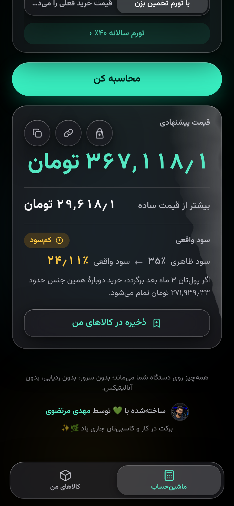
</div>

**نکته** — عدد تورم پیش‌فرض از مرکز آمار ایران است و در تنظیمات قابل تغییر. اگر قیمت خرید
جدید را از بنکدار پرسیده‌اید، همان را وارد کنید؛ از هر تخمینی دقیق‌تر است.

---

### 🧾 فروش اقساطی

**کی به کارتان می‌آید؟** وقتی قسطی می‌فروشید و نمی‌خواهید سر ماه‌های بعد ضرر کنید.

**چه کار کنید**
۱. در برگهٔ «درصد سود»، بالای صفحه از **«نقدی»** به **«اقساطی»** بروید.
۲. برای گرفتن مبلغ درست: **«چقدر اضافه بگیرم؟»**. برای سنجیدن شرایط فعلی‌تان:
   **«شرایط فعلی‌ام سودده است؟»**.
۳. **«قیمت نقدی»**، **«پیش‌پرداخت»** و **«تعداد اقساط»** را بزنید.

**مثال ۱ — چقدر اضافه بگیرم؟** کالای ۱۰٬۰۰۰٬۰۰۰ تومانی، ۴٬۰۰۰٬۰۰۰ پیش‌پرداخت، ۶ قسط:

| | |
| --- | --- |
| قسط ماهانه | ۱٬۱۲۲٬۳۱۳ |
| جمع دریافتی | ۱۰٬۷۳۳٬۸۸۰ |
| درصد اضافه لازم | حدود ۷٫۳۴٪ |
| معادل سود سادهٔ ماهانه | حدود ۲٫۰۴٪ |

**مثال ۲ — شرایط فعلی‌ام سودده است؟** همان کالا با «ماهی ۲٪» که خیلی‌ها می‌گیرند:
قسط **۱٬۱۲۰٬۰۰۰**، ولی این پول‌ها امروز فقط **۹٬۹۸۷٬۶۳۳** می‌ارزد — یعنی حدود
**۰٫۱۲٪ زیان** نسبت به فروش نقدی. تقریباً سر به سر.

<div align="center">
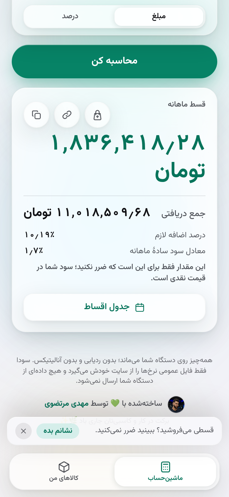
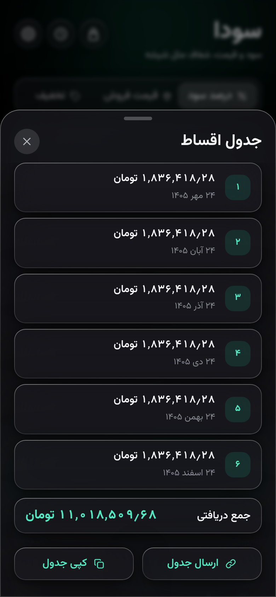
</div>

**نکته** — **«جدول اقساط»** را باز کنید و برای مشتری بفرستید: تاریخ و مبلغ هر قسط با تقویم
شمسی، بدون هیچ اشاره‌ای به سود شما.

---

### 📦 کالاهای من

**کی به کارتان می‌آید؟** وقتی چند ده قلم جنس دارید و نمی‌خواهید قیمت‌ها از دست‌تان در برود.

**چه کار کنید**
۱. بعد از هر محاسبه، **«ذخیره در کالاهای من»** را بزنید.
۲. از نوار پایین به **«کالاهای من»** بروید.
۳. برای تغییر دسته‌جمعی قیمت‌ها، دکمهٔ تغییر گروهی را بزنید، پیش‌نمایش را ببینید و تأیید کنید.

**مثال** — همان شال، سه ماه بعد از آخرین ثبت قیمت: هزینهٔ خرید دوباره حدود **۴۴۲٬۲۰۳**،
حاشیهٔ واقعی حدود **۸٫۵۵٪**، و نشان **«کم‌سود»**.

<div align="center">
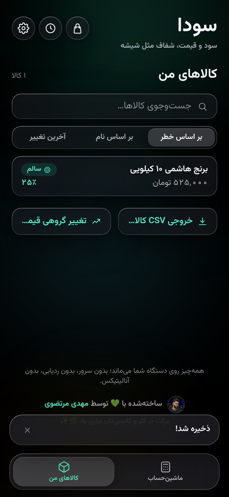
</div>

**نکته** — تغییر گروهی ۱۰ ثانیه فرصت **برگرداندن** دارد. رند کردن هم همیشه رو به **بالا**
است تا سودتان از دست نرود: قیمت ۵۳۰٬۶۴۳٫۵ با پلهٔ ۵٬۰۰۰ می‌شود **۵۳۵٬۰۰۰**.

---

### 📈 نرخ گرانی هوشمند

**کی به کارتان می‌آید؟** وقتی می‌خواهید تخمین گرانی، مخصوص کالای خودتان باشد نه یک عدد
کلی برای همهٔ بازار.

**چه کار کنید**
۱. اولین باری که سودا بپرسد، **«چه چیزی می‌فروشید؟»** و **«اجناس‌تان وارداتی است؟»** را
   جواب بدهید (یا **«فعلاً نه»**؛ هر وقت خواستید از تنظیمات عوضش کنید).
۲. هر بار جنس می‌خرید، قیمت خرید جدید را ثبت کنید.
۳. در صفحهٔ هر کالا، **«چرا این عدد؟»** را باز کنید.

<div align="center">
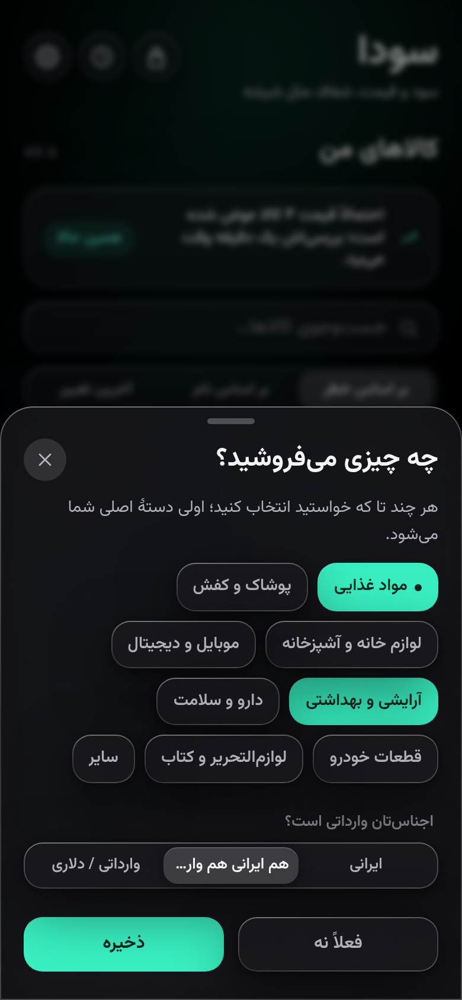
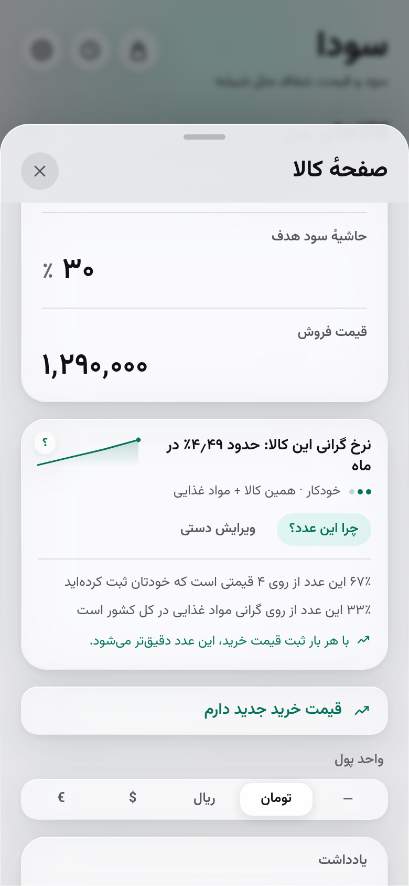
</div>

**مثال** — کالایی با سه قیمت خرید ثبت‌شده در شش ماه (۳۲۰٬۰۰۰ · ۳۵۵٬۰۰۰ · ۴۰۰٬۰۰۰):

| | |
| --- | --- |
| نرخ گرانی | حدود ۴٫۱۱٪ در ماه |
| از روی قیمت‌های خودتان | ۶۰٪ |
| دقت تخمین | متوسط |
| قیمت خرید امروز (تخمین) | حدود ۴۱۶٬۴۵۳ |

<div align="center">
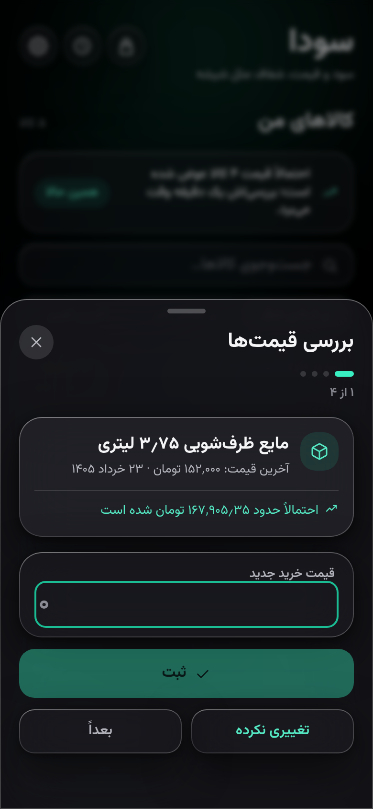
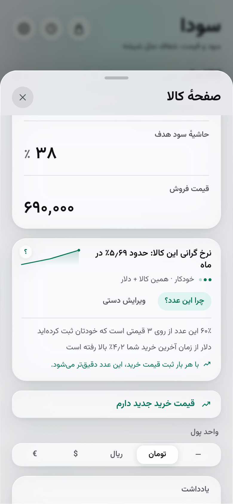
</div>

**نکته** — «دقت تخمین: متوسط» یعنی سودا هم روی قیمت‌های خودتان حساب می‌کند و هم روی آمار
کشوری. هر قیمت خریدی که ثبت کنید این عدد را دقیق‌تر می‌کند. برای کالای وارداتی،
سودا جداگانه می‌گوید دلار از آخرین خرید شما چقدر بالا یا پایین رفته.

---

### 🧺 سبد محاسبه

**کی به کارتان می‌آید؟** وقتی چند قلم را با هم می‌فروشید و جمع سود کل را می‌خواهید.

**چه کار کنید**
۱. بعد از هر محاسبه، نتیجه را به سبد اضافه کنید.
۲. از بالای صفحه سبد را باز کنید.
۳. جمع کل و حاشیهٔ سود کلی را ببینید.

<div align="center">
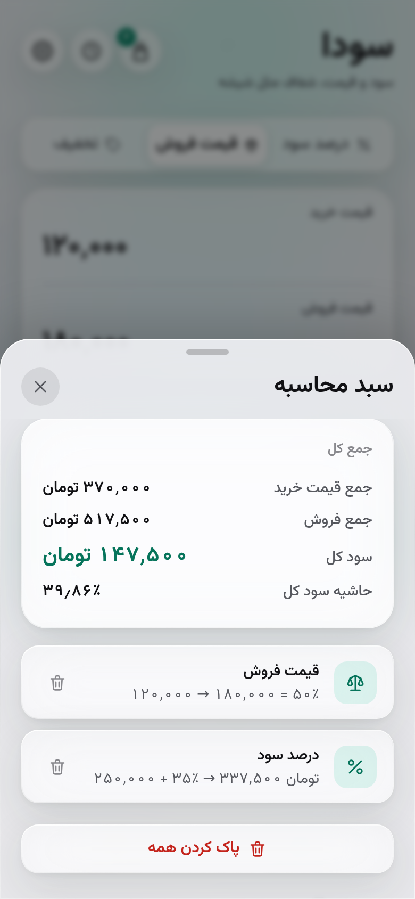
</div>

**نکته** — تعداد اقلام سبد روی آیکون بالای صفحه نشان داده می‌شود.

---

### 🕘 تاریخچه

**کی به کارتان می‌آید؟** وقتی می‌خواهید ببینید دیروز برای فلان جنس چه حساب کردید.

**چه کار کنید** — آیکون ساعت بالای صفحه را بزنید؛ جست‌وجو کنید؛ **«خروجی CSV»** بگیرید.

<div align="center">
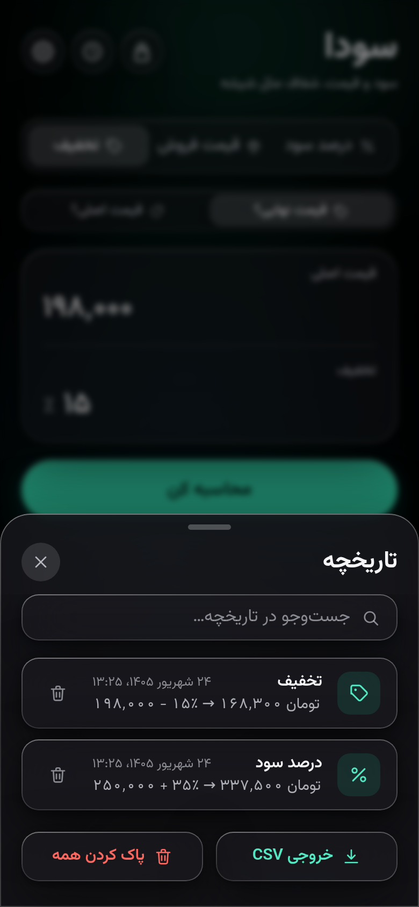
</div>

**نکته** — فایل CSV با اکسل باز می‌شود و فارسی را درست نشان می‌دهد.

---

### 🔗 لینک اشتراک

**کی به کارتان می‌آید؟** وقتی می‌خواهید یک محاسبه را برای شریک یا مشتری بفرستید.

**چه کار کنید** — زیر نتیجه، **«اشتراک‌گذاری لینک نتیجه»** را بزنید و لینک را بفرستید.

**نکته** — لینک، واحد پول شما را هم با خودش می‌برد، تا طرف مقابل عدد تومانی را ریالی نبیند.

---

### 💾 پشتیبان‌گیری و بازیابی

**کی به کارتان می‌آید؟** قبل از عوض‌کردن گوشی.

**چه کار کنید** — **«تنظیمات»** ← بخش پشتیبان‌گیری ← یک فایل بگیرید. روی گوشی جدید همان
فایل را بازیابی کنید (ادغام یا جایگزینی).

**نکته** — کالاها، تاریخچهٔ قیمت‌شان، سبد و تنظیمات همه در همان یک فایل هستند.

---

### ⚙️ تنظیمات

**کی به کارتان می‌آید؟** برای زبان، پوستهٔ روشن/تیره، واحد پول، رند کردن، عدد تورم،
**«مشخصات مغازه»** و به‌روزرسانی خودکار نرخ‌ها.

<div align="center">
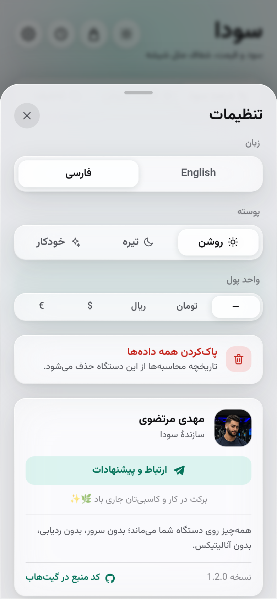
</div>

**نکته** — **«پاک‌کردن همه داده‌ها»** واقعاً همه‌چیز را پاک می‌کند: تاریخچه، سبد، کالاها و
تاریخچهٔ قیمت‌شان. فقط زبان، پوسته و واحد پول می‌ماند.

---

### 📲 نصب روی گوشی و کار آفلاین

**کی به کارتان می‌آید؟** همیشه — مخصوصاً وقتی اینترنت مغازه ضعیف است.

**چه کار کنید**
۱. سودا را در مرورگر باز کنید.
۲. روی اندروید دکمهٔ نصب خودش می‌آید؛ روی آیفون از منوی اشتراک‌گذاری
   «Add to Home Screen» را بزنید.
۳. از این به بعد مثل یک اپ روی گوشی باز می‌شود.

<div align="center">
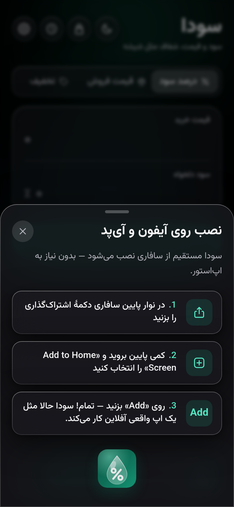
</div>

**نکته** — بعد از اولین باز شدن، سودا **بدون اینترنت** هم کامل کار می‌کند.

---

### 🔄 به‌روزرسانی خودکار

سودا خودش نسخهٔ جدید را می‌گیرد و دفعهٔ بعد که باز کنید، تازه‌هایش را نشان می‌دهد.
چیزی برای نصب دستی وجود ندارد.

---

## ❓ سؤال‌های رایج

**سود واقعی یعنی چه؟**
سود ظاهری یعنی فروش منهای خرید. سود واقعی یعنی بعد از اینکه همان جنس را دوباره خریدید،
واقعاً چقدر برایتان مانده. در بازاری که قیمت‌ها بالا می‌رود، این دو خیلی با هم فرق دارند.

**نرخ گرانی از کجا می‌آید و چقدر دقیق است؟**
از سه چیز: قیمت‌های خریدی که خودتان ثبت کرده‌اید، آمار گرانی دستهٔ کالای شما، و دلار
(اگر کالا وارداتی باشد). همیشه یک **تخمین** است، نه عدد قطعی — برای همین سودا همه‌جا
می‌گوید «حدود»، و با **«چرا این عدد؟»** نشان می‌دهد چند درصدش از کجا آمده.

**تورم را نمی‌دانم؛ مشکلی است؟**
نه. سودا یک عدد پیش‌فرض دارد (امروز: ۳٫۴٪ **در ماه**، از مرکز آمار ایران — شاخص قیمت
مصرف‌کننده، مرداد ۱۴۰۵). اگر عدد بهتری دارید، در تنظیمات عوضش کنید. و اگر قیمت خرید
جدید را می‌دانید، اصلاً نیازی به تورم نیست: همان را مستقیم وارد کنید.

**اطلاعاتم کجا ذخیره می‌شود؟**
روی همین گوشی، و فقط همین‌جا. حساب کاربری ندارد، سرور ندارد، و هیچ داده‌ای از دستگاه شما
ارسال نمی‌شود. تنها چیزی که سودا از اینترنت می‌گیرد، یک فایل عمومی نرخ‌ها از سایت خودش
است — و همان را هم می‌توانید در تنظیمات خاموش کنید.

**گوشی‌ام را عوض کنم چه می‌شود؟**
از تنظیمات یک فایل پشتیبان بگیرید و روی گوشی جدید بازیابی کنید. چون اطلاعات روی گوشی
است، بدون پشتیبان با پاک‌شدن مرورگر از بین می‌رود.

**اپ چطور آپدیت می‌شود؟**
خودکار. سودا هرچند وقت یک‌بار نسخهٔ جدید را می‌گیرد و دفعهٔ بعد که بازش کنید، فهرست
تازه‌ها را نشان می‌دهد.

**سودا رایگان است؟**
بله، کاملاً رایگان و متن‌باز، با مجوز MIT.

</div>

## 📱 اسکرین‌شات‌ها

<div align="center">

| درصد سود | قیمت فروش (زیان) | تخفیف |
| :---: | :---: | :---: |
| 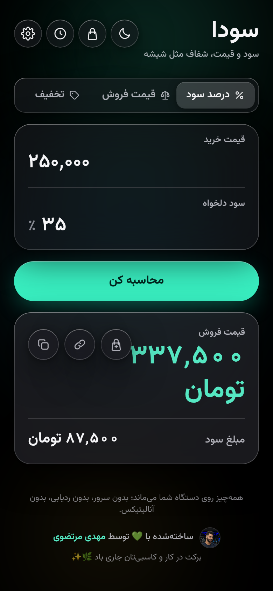 | 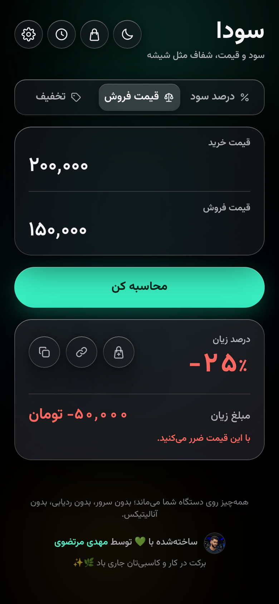 |  |

| کالاهای من | سبد محاسبه | تاریخچه |
| :---: | :---: | :---: |
|  |  |  |

| نرخ گرانی و «چرا این عدد؟» | بررسی قیمت‌ها | مشخصات مغازه |
| :---: | :---: | :---: |
|  |  |  |

| اولین اجرا | نصب روی آیفون | تنظیمات |
| :---: | :---: | :---: |
| 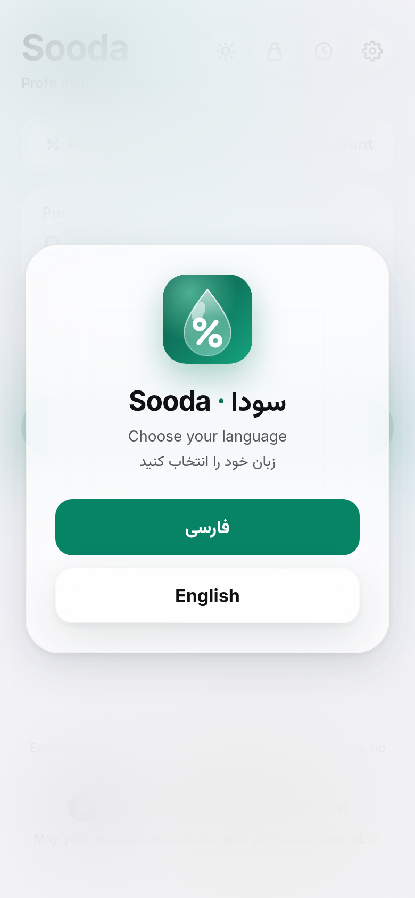 |  |  |

</div>

<div dir="rtl">

## 🗺 نقشهٔ راه

- [x] چهار ماشین‌حساب: درصد سود، قیمت فروش، تخفیف و تخفیف معکوس
- [x] دوزبانهٔ کامل با راست‌چین · ارقام فارسی · جداکنندهٔ سه‌رقمی زنده
- [x] کار کامل آفلاین · تجربهٔ نصب · میان‌برهای صفحهٔ اصلی
- [x] تاریخچه + CSV · واحد پول · لینک اشتراک · سبد محاسبه
- [x] سود واقعی — سود ظاهری در برابر آنچه بعد از خرید دوباره می‌ماند
- [x] فروش اقساطی، بررسی شرایط فعلی و جدول اقساط برای مشتری
- [x] کالاهای من با نشان سلامت قیمت، تغییر گروهی و برگرداندن
- [x] گرد کردن قابل‌تنظیم (رند کردن قیمت فروش رو به بالا)
- [x] پشتیبان‌گیری و بازیابی · بررسی خودکار به‌روزرسانی · نمایش تازه‌ها
- [x] نرخ گرانی هوشمند برای هر کالا، با «چرا این عدد؟» و بررسی قیمت‌ها
- [ ] نام‌گذاری اقلام سبد و خروجی گرفتن از سبد
- [ ] نمودار روند حاشیهٔ سود هر کالا
- [ ] یادداشت تأمین‌کننده و یادآور سفارش مجدد

## 👋 با سازنده آشنا شوید

</div>

<div align="center">


**مهدی مرتضوی** · Mahdi Mortazavi

سازندهٔ سودا — خوشحال می‌شوم نظرات، پیشنهادات و سلام‌هایتان را بشنوم.

<a href="https://telegram.me/Mahdi_mortazavi1"></a>

*برکت در کار و کاسبی‌تان جاری باد 🌿✨*

</div>

<div dir="rtl">

## 🤝 مشارکت و مجوز

از مشارکت شما استقبال می‌کنیم — [CONTRIBUTING.md](./CONTRIBUTING.md) و
[آیین‌نامهٔ رفتار](./CODE_OF_CONDUCT.md) را ببینید. منتشرشده با مجوز [MIT](./LICENSE).

</div>

<details>
<summary><b>🛠 پشت صحنه (برای برنامه‌نویس‌ها)</b></summary>

<div dir="rtl">

React 18 · TypeScript (strict) · Vite 6 · Tailwind v4 · Dexie (IndexedDB) ·
i18next · motion · vite-plugin-pwa (Workbox).

- کل محاسبات در `src/lib/` است: توابع خالص، بدون وابستگی به رابط کاربری، با تست.
- تخمین نرخ گرانی در `src/lib/rates/` — وزن‌دهی نمایی روی قیمت‌های ثبت‌شده، ترکیب با
  شاخص دسته و حساسیت دلاری، و محدود به بازهٔ محتاطانهٔ ماهانهٔ −۵٪ تا +۲۵٪.
- فایل نرخ‌ها (`public/data/rates.json`) عمداً در حافظهٔ پنهان نصب‌شده نیست، تا
  به‌روزرسانی روزانهٔ نرخ باعث نشود همهٔ دستگاه‌ها آپدیت اپ بگیرند. جزئیات در
  [`docs/rates.md`](./docs/rates.md).
- اعداد همهٔ مثال‌های این راهنما با `npm run docs:examples` از خود موتور محاسبه گرفته شده‌اند.

**اندازه و کارایی (اندازه‌گیری‌شده، نه ادعا)** — حجم بارگذاری اولیه حدود ۱۲۶ کیلوبایت
فشرده (`npm run budget`). در Lighthouse روی همین بیلد، **دسترس‌پذیری ۱۰۰** و
**Best Practices ۱۰۰**. امتیاز Performance را عمداً اینجا ننوشته‌ایم، چون سرور
آزمایشی محلی فشرده‌سازی و هدرهای کش گیت‌هاب‌پیجز را ندارد و عدد واقعی نیست.

</div>
</details>

<details>
<summary><b>🧑‍💻 توسعهٔ محلی</b></summary>

```bash
npm install
npm run dev        # سرور توسعه
npm run verify     # typecheck + تست + build
npm run budget     # سقف حجم بارگذاری اولیه
npm run docs:examples -- --check   # اعداد مستندات با موتور جور است؟
```

</details>
