<div align="center">

[🇮🇷 **نسخهٔ فارسی**](./README.fa.md)

<br />


# Sooda

### Profit math, crystal clear. 💎

**You made 20% profit — but can you still afford to restock? Sooda answers that question.**

A profit, price and discount calculator for sellers. Works fully offline,
speaks English and فارسی, and tracks nothing.

<br />

<a href="https://mahdi-mortazavi.github.io/sooda/"></a>

[](https://github.com/Mahdi-mortazavi/sooda/actions/workflows/deploy.yml)
[](https://mahdi-mortazavi.github.io/sooda/)
[](./LICENSE)
[](./tsconfig.json)

<br />

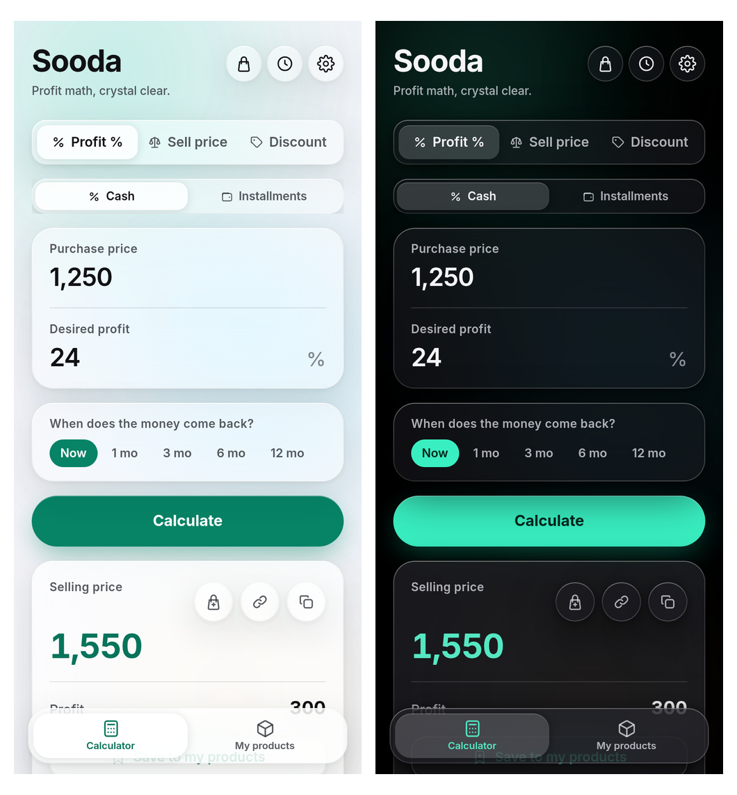

</div>

<br />

## 📖 The story

It's 9pm and Reza is pulling down the shutter. He sold ten shawls today, each at 20% profit,
and he's pleased. He bought them three months ago at 400,000 toman each.

The next morning his wholesaler calls: prices are up. Only now does he realise that the money
from those ten shawls will not buy ten shawls. His profit looked like 80,000 each — but
restocking the same shawl now costs about **442,203**. Of that 20%, roughly **8.55%** is
actually left.

That is the moment Sooda is built for. Reza enters his purchase and selling price, and next to
the nominal profit Sooda shows the **real** profit — flagged as thin, with a suggested price
that covers buying the goods again.

That afternoon a customer wants a 10,000,000 item on instalments. Reza opens
*"Is my deal profitable?"* and finds that the flat 2%/month he has always charged now barely
**breaks even** — a 0.12% loss, which is to say he is working for free. He fixes the number, and
sends the customer a payment schedule with no mention of his own margin.

And the imported item priced in dollars? Sooda estimates a monthly price-growth rate for each
product separately — and tells him where that number came from.

## ⚡ Sooda in 30 seconds

<div align="center">
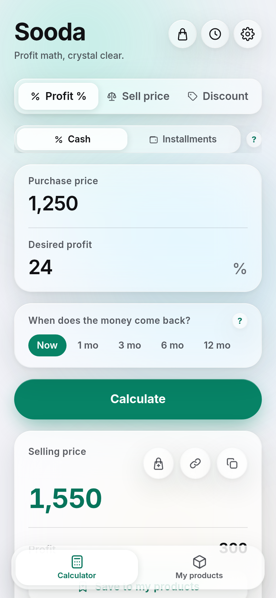
</div>

1. [Open Sooda](https://mahdi-mortazavi.github.io/sooda/) — no install, no sign-up.
2. Under **Profit %**, enter **Purchase price** 400,000 and **Desired profit** 20.
3. Tap **Calculate**.

Selling price **480,000** · Profit **80,000**.

That's it. The rest of this guide is about what Sooda does *beyond* that.

---

## 📘 Step-by-step guide

### 🧮 Profit %

**When you need it** — you know what you paid and want to sell at a set margin.

**What to do** — open **Profit %**, enter **Purchase price** and **Desired profit**, tap **Calculate**.

**Example** — a 400,000 shawl at 20%: selling price **480,000**, profit **80,000**.

**Tip** — that's the *nominal* profit. For what's left after restocking, use the real-profit lens below.

---

### 🏷 Selling price

**When you need it** — a price is already on the item and you want to know the margin.

**What to do** — open **Selling price**, enter **Purchase price** and **Selling price**, tap **Calculate**.

**Example** — bought 400,000, sold 480,000: **20%**, i.e. **80,000**.

**Tip** — a loss is flagged in words as well as colour ("You're losing money at this price."),
never colour alone.

---

### 🎁 Discount & reverse discount

**When you need it** — running a sale, or working out what the original price was.

**What to do** — open **Discount** (or **Reverse discount**), enter the price and the percentage, tap **Calculate**.

**Example** — 15% off 480,000: final price **408,000**, saved **72,000**.
And back the other way: a 408,000 price that was 15% off started at **480,000**.

<div align="center">
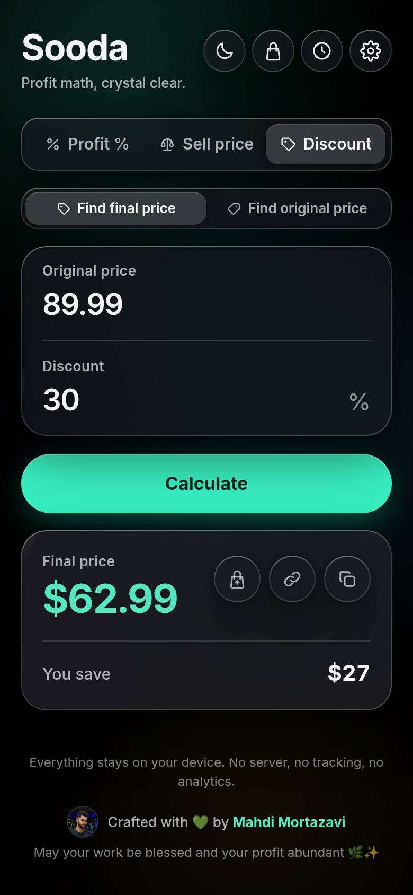
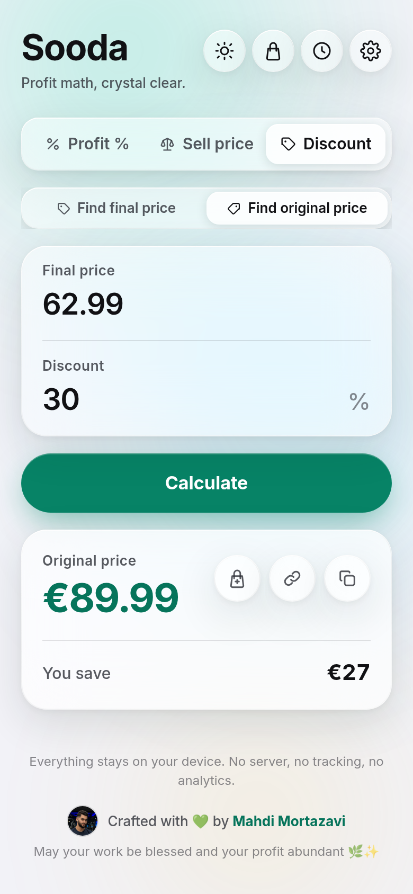
</div>

**Tip** — reverse discount is the quick way to check an advertised "70% off".

---

### 💸 Real profit — "When does your money come back?"

**When you need it** — always. This is the heart of Sooda.

**What to do**
1. In Profit % or Selling price, open **When does your money come back?**
2. Pick when the money returns: **Now**, **1 month**, **3 months**, **6 months** or **12 months**.
3. If you already know the new purchase price, choose **I know the current purchase price**;
   otherwise leave **Estimate with inflation**.

**Example** — the 400,000 shawl sold at 480,000, money back in 3 months:

| | |
| --- | --- |
| Monthly inflation | 3.4% |
| Restock cost (estimate) | about 442,203 |
| **Real profit** | **about 8.55%** — thin |
| Suggested price | about 530,644 |

<div align="center">
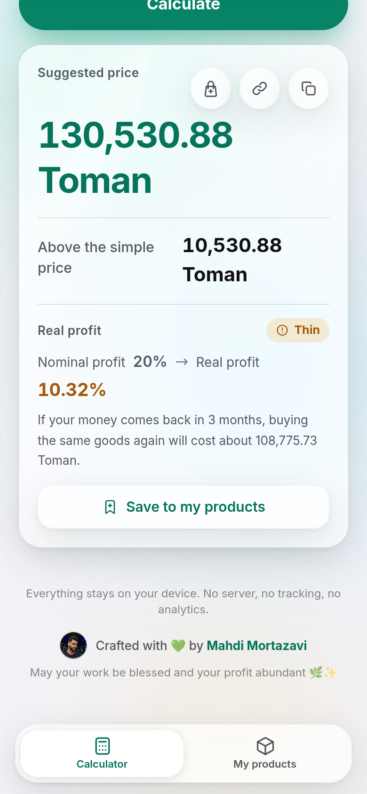
</div>

**Tip** — the default inflation figure comes from the Statistical Center of Iran and can be
changed in Settings. If your wholesaler has quoted you a new price, enter that instead — it
beats any estimate.

---

### 🧾 Instalment pricing

**When you need it** — selling on instalments without quietly losing money.

**What to do**
1. In the Profit tab, switch from **Cash** to **Instalments**.
2. Choose **How much should I add?** to price a plan, or **Is my deal profitable?** to test the terms you already offer.
3. Enter **Cash price**, **Down payment** and **Number of instalments**.

**Example 1 — How much should I add?** A 10,000,000 item, 4,000,000 down, 6 payments:

| | |
| --- | --- |
| Monthly payment | 1,122,313 |
| Total collected | 10,733,880 |
| Markup needed | about 7.34% |
| Equivalent flat monthly | about 2.04% |

**Example 2 — Is my deal profitable?** The same item at the flat 2%/month many shops charge:
payments of **1,120,000**, but worth only **9,987,633** today — about a **0.12% loss** against
selling for cash. Barely break-even.

<div align="center">
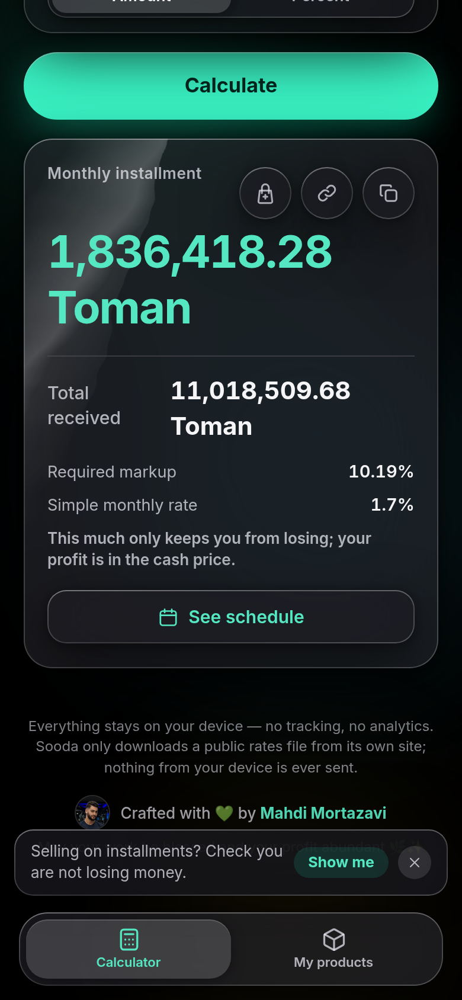
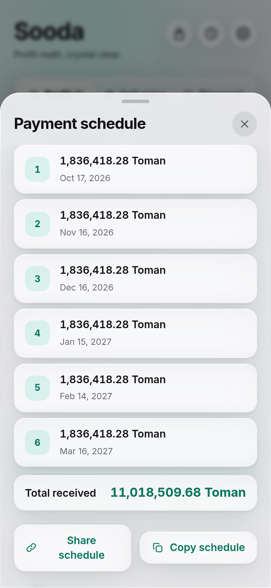
</div>

**Tip** — open the **payment schedule** and send it to the customer: every date and amount in
the Persian calendar, with nothing about your margin.

---

### 📦 My products

**When you need it** — you carry dozens of lines and don't want prices drifting behind costs.

**What to do**
1. After any calculation, tap **Save to my products**.
2. Open **My products** from the bottom bar.
3. To reprice many at once, open bulk reprice, check the preview, then confirm.

**Example** — the same shawl, three months after its cost was last recorded: restock cost about
**442,203**, real margin about **8.55%**, health chip **thin**.

<div align="center">
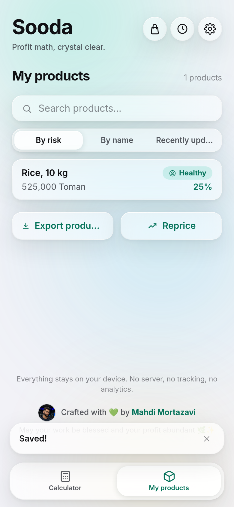
</div>

**Tip** — bulk reprice has a 10-second **undo**. Rounding always goes **up**, so margin is never
lost: 530,643.5 with a 5,000 step becomes **535,000**.

---

### 📈 Smart price growth

**When you need it** — when you want the inflation estimate to fit *your* product rather than
one national number for the whole market.

**What to do**
1. Answer **What do you sell?** and **Are your goods imported?** the first time Sooda asks
   (or skip — you can set it later in Settings).
2. Record the new purchase price each time you restock.
3. On a product's page, open **Why this number?**

<div align="center">
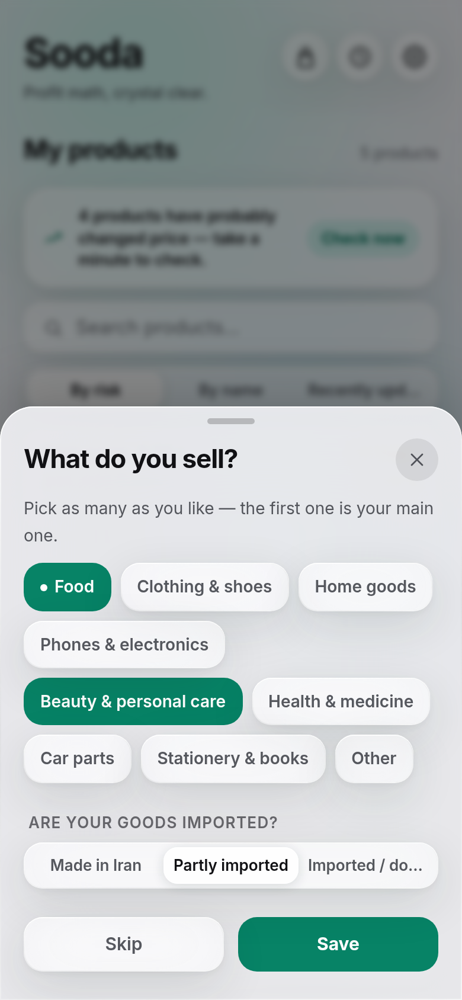
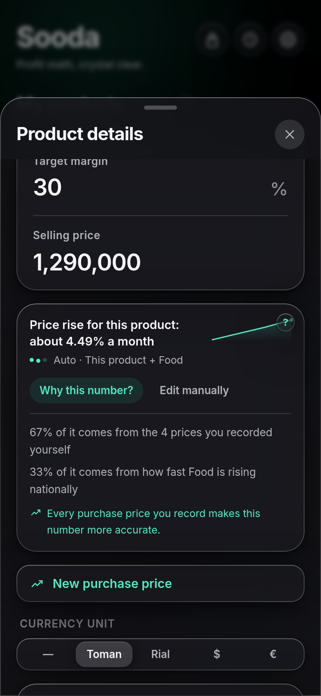
</div>

**Example** — a product with three purchase prices recorded over six months (320,000 · 355,000 · 400,000):

| | |
| --- | --- |
| Price growth | about 4.11% a month |
| From your own prices | 60% |
| Estimate quality | medium |
| Restock cost today (estimate) | about 416,453 |

<div align="center">
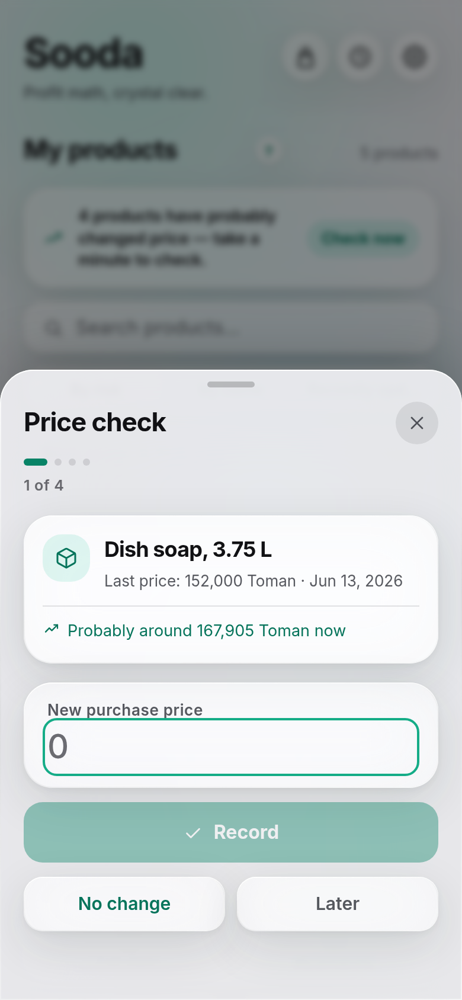
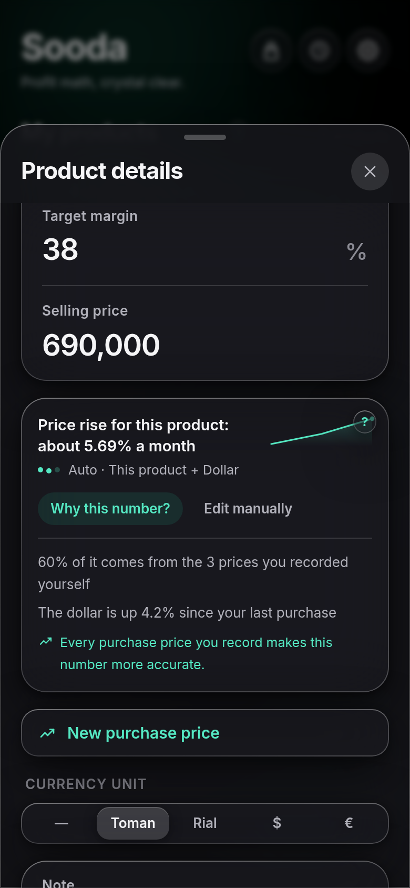
</div>

**Tip** — "medium" means Sooda is blending your own prices with the national figures.
Every purchase price you record sharpens it. For an imported product, Sooda separately shows
how far the dollar has moved since your last purchase.

---

### 🧺 Basket · 🕘 History · 🔗 Share link

- **Basket** — add results together to see combined totals and overall margin.
- **History** — every calculation, searchable, exportable as CSV that opens correctly in Excel.
- **Share link** — send a calculation to a partner or customer. The link carries your currency
  with it, so a toman figure is never read as rial.

<div align="center">
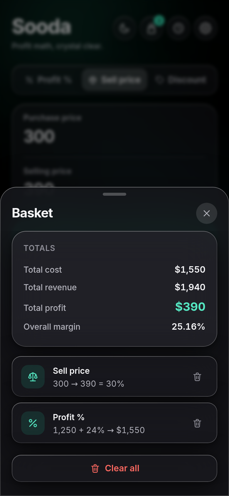
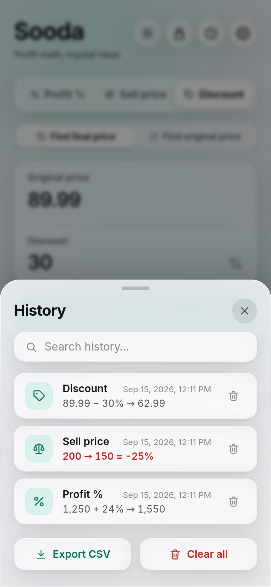
</div>

---

### 💾 Backup · ⚙️ Settings

**Backup** — Settings → back up to a file before changing phones, then restore on the new one
(merge or replace). Products, their price history, basket and settings are all in that file.

**Settings** — language, light/dark, currency, rounding, the inflation figure, **Store profile**,
and automatic rate updates.

<div align="center">
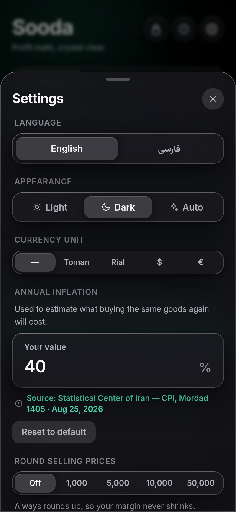
</div>

**Tip** — **Erase all data** really does erase everything: history, basket, products and their
price history. Only language, theme and currency are kept.

---

### 📲 Install & offline

Open Sooda in a browser. Android offers an install button; on iPhone use Share → *Add to Home
Screen*. After the first load it works **with no internet at all**, and updates itself
automatically — there is nothing to install by hand.

<div align="center">
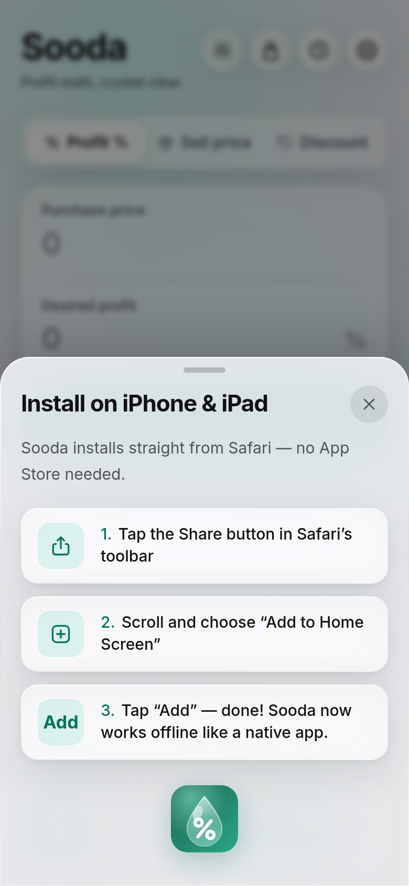
</div>

---

## ❓ FAQ

**What is "real profit"?**
Nominal profit is selling price minus purchase price. Real profit is what's left once you've
bought the same goods again. In a market where prices rise, the two are very different numbers.

**Where does the price-growth rate come from, and how accurate is it?**
Three things: the purchase prices you record yourself, the inflation figure for your product's
category, and the dollar (for imported goods). It is always an **estimate** — which is why
Sooda says "about" everywhere, and why **Why this number?** breaks down where each part came from.

**I don't know the inflation rate — is that a problem?**
No. Sooda ships with a default (currently 3.4% **a month**, from the Statistical Center of Iran —
CPI, Mordad 1405). Change it in Settings if you have a better figure. And if you know the new
purchase price, you don't need inflation at all: enter it directly.

**Where is my data stored?**
On this device, and only here. No account, no server, and nothing from your device is ever sent.
The only thing Sooda downloads is a public rates file from its own site — and you can turn that
off in Settings.

**What if I change phones?**
Back up to a file in Settings and restore it on the new phone. Because the data lives on the
device, clearing your browser without a backup loses it.

**How does the app update?**
Automatically. Sooda checks periodically and shows you what's new next time you open it.

**Is it free?**
Yes — free and open source under the MIT licence.

---

## 📱 Screenshots

<div align="center">

| Profit % | Selling price (loss) | Discount |
| :---: | :---: | :---: |
| 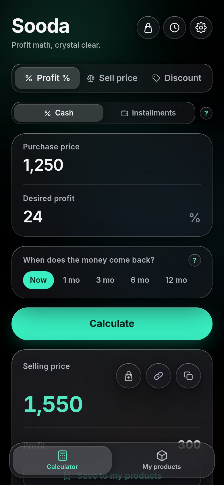 | 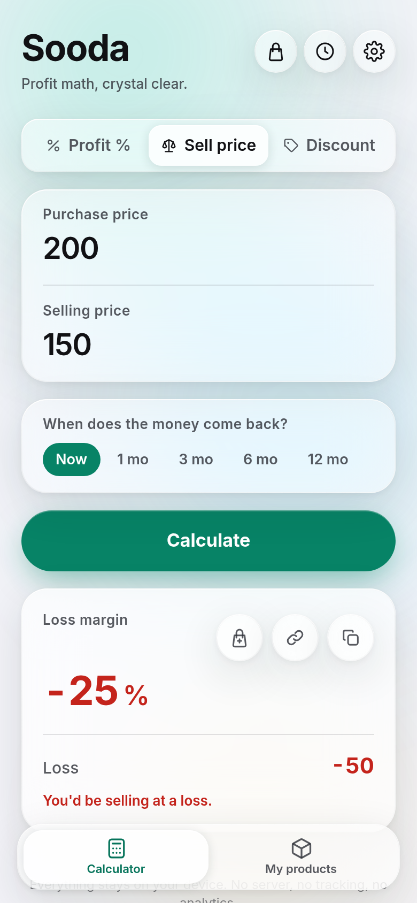 |  |

| My products | Basket | History |
| :---: | :---: | :---: |
|  |  |  |

| Smart rate & "Why this number?" | Price check-in | Store profile |
| :---: | :---: | :---: |
|  |  |  |

| First launch | iOS install guide | Settings |
| :---: | :---: | :---: |
|  |  |  |

</div>

## 🗺 Roadmap

- [x] Four calculators: profit %, selling price, discount, reverse discount
- [x] Full bilingual RTL · Persian digits · live thousand separators
- [x] Fully offline · install experience · home-screen shortcuts
- [x] History + CSV · currency · share links · basket
- [x] Real profit — nominal margin vs what survives restocking
- [x] Instalment pricing, deal checking and a customer-facing schedule
- [x] My products with health chips, bulk reprice and undo
- [x] Configurable rounding (always up, so margin is never lost)
- [x] Backup & restore · automatic update checks · What's New
- [x] Smart per-product price growth, with "Why this number?" and price check-in
- [ ] Naming and exporting basket items
- [ ] Per-product margin trend chart
- [ ] Supplier notes and restock reminders

## 👋 Meet the maker

<div align="center">


**Mahdi Mortazavi** · مهدی مرتضوی

Maker of Sooda — feedback, ideas and hellos all welcome.

<a href="https://telegram.me/Mahdi_mortazavi1"></a>

*May your work and trade be blessed 🌿✨*

</div>

## 🤝 Contributing & licence

Contributions welcome — see [CONTRIBUTING.md](./CONTRIBUTING.md) and the
[Code of Conduct](./CODE_OF_CONDUCT.md). Released under the [MIT licence](./LICENSE).

<details>
<summary><b>🛠 Under the hood</b></summary>

React 18 · TypeScript (strict) · Vite 6 · Tailwind v4 · Dexie (IndexedDB) · i18next · motion ·
vite-plugin-pwa (Workbox).

- All maths lives in `src/lib/` as pure, UI-free, tested functions.
- The price-growth estimate is in `src/lib/rates/`: exponentially weighted least squares over
  your recorded prices, blended with a category index and a dollar sensitivity, and held inside
  a cautious −5%…+25% monthly band.
- The rates file (`public/data/rates.json`) is deliberately **not** precached, so a daily rate
  refresh doesn't push an app update to every installed device. See [`docs/rates.md`](./docs/rates.md).
- Every example number in this README is produced by `npm run docs:examples` from the real engine.

**Size and performance (measured, not claimed)** — first-paint payload is about 126 KB gzipped
(`npm run budget`). Lighthouse on this build scores **accessibility 100** and
**best practices 100**. The Performance score is deliberately not quoted here: the local test
server has neither the gzip nor the cache headers GitHub Pages serves, so any number it produces
would be misleading.

</details>

<details>
<summary><b>🧑‍💻 Local development</b></summary>

```bash
npm install
npm run dev        # dev server
npm run verify     # typecheck + tests + build
npm run budget     # first-paint payload ceiling
npm run docs:examples -- --check   # do the README numbers still match the engine?
```

</details>
